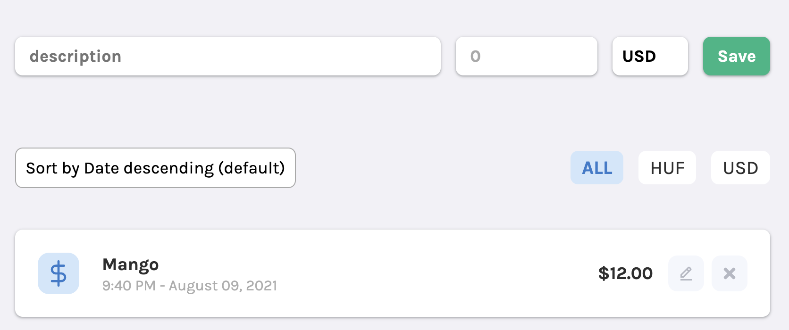

# Polygence Coding Challenge

Welcome to the coding challenge portion of the Polygence Engineering interview! Thank you for taking the time to go through this exercise and show us what you can contribute to the team.

## Project overview



We want you to create a simple application to track spendings.

A spending has the followings properties:

- when it happened
- how much did we spend
- in what currency
- for what/description

This simple web app allows the users to:

- Create a new spending
- List all the spendings
- List all the spendings ordered by amount, date
- List all the spendings filtered by currency

A spending JSON object looks something like this:

```json
{
  "description": "Mango",
  "amount": 1200,
  "spent_at": "2022-02-23T14:47:20.381Z",
  "currency": "USD"
}
```

### Technical requirements

- Use Git and share the project on GitHub
- The frontend solution can be written in any frontend framework
  - Preferably in React

### Acceptance criteria

```cucumber
Given there are no existing spendings
When I fill the description, currency and amount
And I click the "Save" button
Then I see my spending in the list
And the spending is persisted on the server
And the form is emptied

Given that I have not filled the description or the amount
When I click the "Save" button
Then I see an error indicating the missing field

Given there are existing spendings in the list
When I change the selected ordering
Then the list is reorder by the selection

Given there are existing spendings in the list
When I click on a currency filter button (HUF, USD, All)
Then the list is filtered by that selection
And shows only the matching spendings
```

### What We Look For

This is an opportunity for you to show us what your best code looks like. While we expect the code to work, we are also looking for:

- Clean, modular code
- Clear naming and conventions
- Unit tests
- Error handling

### Not required, but nice to have

- Use a web application framework (eg. React)
- Use centralized store (eg. redux)

## The backend API

Base url and API docs: https://shielded-depths-43687-bb049deacd16.herokuapp.com

### `GET /spendings/`

Query parameters:

- `currency`: `string`
  - optional
  - possible values: `HUF`, `USD`
- `order`: `string`
  - optional
  - possible values: `spent_at`, `-spent_at`, `amount`, `-amount`

#### Response

Example: https://shielded-depths-43687-bb049deacd16.herokuapp.com/spendings/

### `POST /spendings/`

Request body:

```json
{
    "description": "string",
    "amount": number,
    "currency": "string",
    "spent_at": "string"
}
```

Where:

- `currency` should be either `HUF` or `USD`
- `spent_at` should be an iso formatted date

#### Response

Example: https://shielded-depths-43687-bb049deacd16.herokuapp.com/spendings/1/
